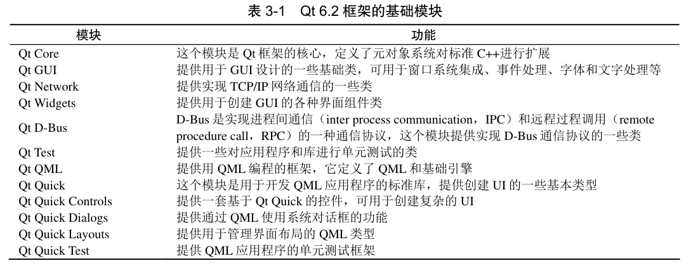
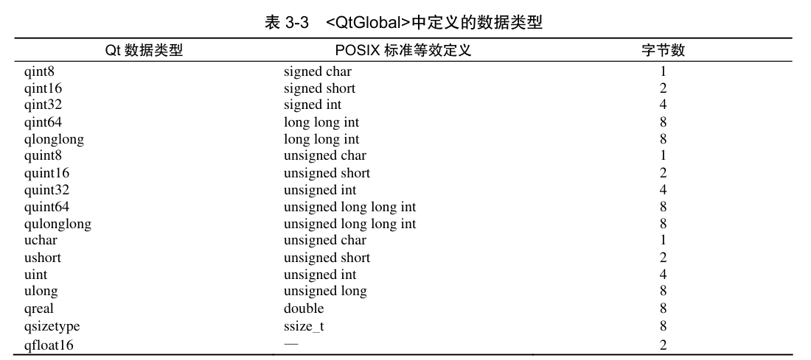

# Qt 学习笔记

## 一、Qt 框架功能

- Qt 6 框架中的模块
    - Qt 基础模块
    

- Qt 全局定义
    - QtGlobal 中定义的数据类型
    

- Qt 的元对象系统
    - Qt 中引入了元对象系统对标准 C++语言进行扩展，增加了信号与槽、属性系统、动态翻译等
    特性，为编写 GUI 应用程序提供了极大的方便。
    - Qt 的元对象系统的功能建立在以下 3 个方面。
        - QObject 类是所有使用元对象系统的类的基类
        - 必须在一个类的开头部分插入宏 Q_OBJECT，这样这个类才可以使用元对象系统的特性
        - MOC 为每个 QObject 的子类提供必要的代码来实现元对象系统的特性
    - 构建项目时，MOC 会读取 C++源文件，当它发现类的定义里有 Q_OBJECT 宏时，它就会为
    这个类生成另一个包含元对象支持代码的 C++源文件，这个生成的源文件连同类的实现文件一起
    被标准 C++编译器编译和连接。

## 二、QString 字符串操作

- 一些概念
  - QString 没有父类
  - QString 存储的是一串字符，每个字符是一个 QChar 类型的数据。
  - QChar 使用的是 UTF-16 编码，一个字符包含 2 字节数据。
  - 对于超过 65535 的 Unicode 编码，QString 使用两个连续的 QChar 字符表示
- QString 字符串的创建和初始化
  - QString str = "Hello Qt";
  - 以“\0”作为结束符
  - QString QString 会使用
    其静态函数 fromUtf8()将这个 const char *类型的数据转换为 UTF-16 编码的字符串。
  - 会使用其静态函数 fromUtf8()将这个 const char *类型的数据转换为 UTF-16 编码的字符串。
- QString 字符串的索引
  - QString 在被创建和初始化后，其存储的字符串就是一个 QChar 字符数组，可以使用元素索引操作符“[ ]”或接口函数 at()访问每个字符。
  - QString 字符串内字符的索引序号是从 0 开始的。
  - 在 QString 字符串中，每个字符都是 QChar 类型，是用 UTF-16 编码的，一个汉字也是一个字符。
- QChar 的功能
  - isDigit -- 是否为 0～9 的数字
  - isLetter -- 判断字符是否为字母
  - isLetterOrNumber -- 判断字符是否为字母或数字
  - isLower -- 判断字符是否为小写字母
  - isUpper -- 判断字符是否为大写字母
  - isMark -- 判断字符是否为记号
  - isNonCharacter -- 判断字符是否为非文字字符
  - isNull -- 判断字符编码是否为 0x0000，也就是“\0”
  - ...
- QString 字符串常用操作
  - 字符串拼接
    - str1= str2 + str1; 
    - str1.append(str2);
  - 字符串截取
    - 函数 front()和 back()。
      - 函数 front()返回字符串中的第一个字符，相当于 at(0)；函数 back()返回字符串中的最后一个字符。
    - 函数 left()和 right()
      - 函数 left()从字符串中提取左边 n 个字符，函数 right()从字符串中提取右边 n 个字符，n 为设定参数。
    - 函数 first()和 last()
      - 函数 first()从字符串中提取最前面的 n 个字符，函数 last()从字符串中提取最后面的 n 个字符，n 为设定参数。
    - 函数 mid()。
      - 数 mid()用于返回字符串中的部分字符串
    - 函数 sliced()
      - 返回字符串的片段
      - 在函数 sliced()中，如果设置的参数会导致超出字符串的边界，则函数的行为是不确定的，但如果是在边界内，则 sliced()的执行速度比 mid()的快。
    - 函数 section()
      - 功能是从字符串中提取以 sep 作为分隔符，从 start 段到 end 段的字符串
